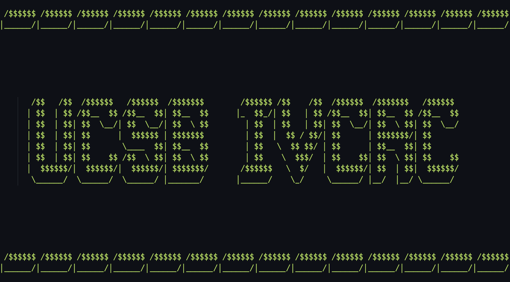

<a name="readme-top"></a>


<!-- PROJECT SHIELDS -->
<!--
*** I'm using markdown "reference style" links for readability.
*** Reference links are enclosed in brackets [ ] instead of parentheses ( ).
*** See the bottom of this document for the declaration of the reference variables
*** for contributors-url, forks-url, etc. This is an optional, concise syntax you may use.
*** https://www.markdownguide.org/basic-syntax/#reference-style-links
-->
[![Contributors][contributors-shield]][contributors-url]
[![Forks][forks-shield]][forks-url]
[![Stargazers][stars-shield]][stars-url]
[![Issues][issues-shield]][issues-url]
[![MIT License][license-shield]][license-url]
[![LinkedIn][linkedin-shield]][linkedin-url]


<!-- PROJECT LOGO -->
<br />
<div align="center">
  <a href="https://github.com/dscpsyl/UCSV-IVCRC-Treasurery-Funding-Request-Tool">
    
  </a>

<h3 align="center">IVCRC Treasury Tool</h3>

  <p align="center">
    This is an internal tool developed for the treasurer of University of California - Santa Barbara (UCSB), Associated Students (AS)  - Isla Vista Community Relations Committee (IVCRC) to help them with their responsibilities as defined by AS Legal Code. 
    <br>
    </br>
    <a href="https://github.com/dscpsyl/UCSV-IVCRC-Treasurery-Funding-Request-Tool/issues">Report Bug</a>
    ·
    <a href="https://github.com/dscpsyl/UCSV-IVCRC-Treasurery-Funding-Request-Tool/issues">Request Feature</a>
  </p>
</div>


<!-- TABLE OF CONTENTS -->
<details>
  <summary>Table of Contents</summary>
  <ol>
    <li>
      <a href="#about-the-project">About The Project</a>
    </li>
    <li>
      <a href="#getting-started">Getting Started</a>
      <ul>
        <li><a href="#prerequisites">Prerequisites</a></li>
        <li><a href="#installation">Installation</a></li>
      </ul>
    </li>
    <li><a href="#usage">Usage</a></li>
    <li><a href="#roadmap">Roadmap</a></li>
    <li><a href="#contributing">Contributing</a></li>
    <li><a href="#license">License</a></li>
    <li><a href="#contact">Contact</a></li>
  </ol>
</details>


<!-- ABOUT THE PROJECT -->
## About The Project



This is an ongoing CLI project that will evolve as new intergrations are added to it. It interacts with the Slack organization of USCB - AS and will require reading through this document to hopefully prevent any confusion throughout setup. The usage, on the other hand, should be relatively simple and intuitive. 

<p align="right">(<a href="#readme-top">back to top</a>)</p>

<!-- GETTING STARTED -->
## Getting Started

The setup for this tool is a bit more complicated than most. It is developed with a specific use case in mind. The CLI is meant only for IVCRC's usage, however if another organization's workflow is similar enough to the one described in this documentaiton, then it can be used for them as well. Otherwise, the `utils` folder has all the python abstractions used in this project and can be repurposed or start as an inspiration for other workflows within the CLI.

### Prerequisites

Becuase this project uses modules such as `lxml`, Python<3.10 is needed. Otherwise, all the other modules are included in the `requirements.txt` file. With a virtural environment or an environment with the correct Python version, you can install all the required modules by running the following command:

### Installation

1. Create the correct environment for your python version.
2. Clone the repo
```sh
git clone https://github.com/dscpsyl/UCSV-IVCRC-Treasurery-Funding-Request-Tool
```
3. Install the required modules.
```sh
pip install -r requirements.txt
```
4. Fill out the credsExample.json file with the correct information and rename it to `creds.json`. This will be used by Google API. More information can be found [here](https://developers.google.com/people/quickstart/python)
5. Fill out the `settingsTemplate.json` file with the correct information and rename it to `settings.json`.
   <details>
      <summary>Settings.json entry details</summary>
      <ol>
        <li>
          <b>treasurerName</b> : The name of the treasurer. This is used to address the treasurer in emails and requesition filler. 
        </li>
        <li>
          <b>treasurerName</b> : The name of the treasurer. This is used to address the treasurer in emails and requesition filler.
        </li>
        <li>
          <b>treasurerEmail</b> : The email of the treasurer. This should also be the same email as the one authenticated in `creds.json` This is used to address the treasurer in emails and requesition filler.
        </li>
        <li>
          <b>treasurerPhone</b> : The phone number of the treasurer. This is used to address the treasurer in emails and requesition filler.
        </li>
        <li>
          <b>slackTags</b> : The userId's from Slack that will be tagged when requesting internal signatures from the organization. The format should be "userid1,userid2,userid3"
        </li>
        <li>
          <b>expendWkbkId</b> : The spreadsheet ID of the Google Sheet that will be used to track all the expenditures. From the URL of the spreadsheet, the ID is: https://docs.google.com/spreadsheets/d/{expendWkbkId}
        </li>
        <li>
          <b>minutesDriveFolderId</b> : The ID of the Google Drive folder that is used to store the minutes of the meetings. From the URL of the folder, the ID is: https://drive.google.com/drive/u/0/folders/{minutesDriveFolderId}
        </li>
        <li>
          <b>reqIncompleteDriveFolderId</b> : The ID of the Google Drive folder that is used to store the incomplete funding requests. From the URL of the folder, the ID is: https://drive.google.com/drive/u/0/folders/{reqIncompleteDriveFolderId}
        </li>
        <li>
          <b>completedReqsDriveFolderId</b> : The ID of the Google Drive folder that is used to store the completed funding requests. From the URL of the folder, the ID is: https://drive.google.com/drive/u/0/folders/{completedReqsDriveFolderId}
        </li>
        <li>
          <b>archiveIncompleteDriveFolderId</b> : The ID of the Google Drive folder that is used to store the pieces of a funding request after compilation. From the URL of the folder, the ID is: https://drive.google.com/drive/u/0/folders/{archiveIncompleteDriveFolderId}
        </li>
        <li>
          <b>SLACK_BOT_TOKEN</b> : The bot token for the Slack organization.
        </li>
        <li>
          <b>SLACK_APP_TOKEN</b> : The app token for the Slack bot.
        </li>
        <li>
          <b>SLACK_TREASURER_CHANNEL_ID</b> : The channel ID of the Slack channel that will be used to communicate funding requests.
        </li>
        <li>
          <b>SLACK_PUBLICITY_CHANNEL_ID</b> : The channel ID of the Slack channel that will be used to communicate with the publicity department.
        </li>
        <li>
          <b>SLACK_HISTORY_CHANNEL_ID</b> : The channel ID of the Slack channel that will be used to communicate with the history department.
        </li>
        <li>
          <b>EXPENDATURE_WORKBOOK_GOOGLESHEET_ID</b> : The column of the Expendature Sheet that is filled for each new expenditure so we can find the first free row. Internally, it should be `💵 Transactions!B:B` if using the standard template.
        </li>
        <li>
          <b>EXPENDATURE_WORKBOOK_GOOGLESHEET_NAME</b> : The column of the Expendature Sheet that has the name of each funding request. Internally, it should be `💵 Transactions!F:F` if using the standard template.
        </li>
        <li>
          <b>IVCRC_SHARED_DRIVE_ID</b> : The main shared drive ID of the IVCRC organization. From the URL of the folder, the ID is: https://drive.google.com/drive/u/0/folders/{IVCRC_SHARED_DRIVE_ID}
        </li>
      </ol>
  </details>

<p align="right">(<a href="#readme-top">back to top</a>)</p>


<!-- USAGE EXAMPLES -->
## Usage

To run the bot, run the following command in a shell you can leave open.
```sh
python bot_run.py
```

The bot has two feactures:
1. The bot will work with Slack Workflows as a trigger to send out chair meeting forms and meeting reminders every week. There must be a Slack Workflow for both the Chair Meeting Reminder and the Meeting Reminder for everything to work well. If the chair does not submit the form before the app needs to send the meeting reminder message (24 hours ahead of the meeting time, set by the workflow trigger time), then the app will default to tagging the Chair and appending a small note at the end.
2. The bot will work with Slack Workflows as a trigger to send out member report forms for every IVCRC member. This is set while setting up the workflow. The bot will check for the member report submission 30 min before the meeting time (also set when setting up the workflow). If the member does not submit the form before the app needs to create the agenda, then the form message will be replaced and the agenda section will be left blank. The bot will automatically compile all responses into a single word doc to be uploaded to Google Drive for user to use. 

If you notice, this bot's weekly automation depends on Soack Workflows. This is becasue I am too lazy to implement my own timing tirggers. In the future, however, for reliability, implementing time triggers should be a priority.

*In the future, we would want this command to be part of the CLI that is running and any output should be given to a log.*


To run the CLI, run the following command in the root directory of the project.
```sh
python CLI_run.py
```

On first startup, there will be a few options you will need to select yes to create credentials, the database, and other files. After that, you will be able to use the CLI without this step. As with any CLI, follow the instructions on screen.

There are 4 different categories that comes with this CLI with their own commands to choose from. 
1. New Entry - Pertaining to any request that has not been introduced to the database.
   1. New Entry
      - This will create a new entry in the database, send out the necessary notifications, create the necessary files, and upload them to Google Drive.
   2. Denied
      - This will send out the necessary notifications of a denied funding request. Follow the instructions on the screen.
2. Existing Funding Request - Pertaining to any request already in the database.
   1. Requisition Setup
    - This will take an existing entry in the database and combine the necessary files into one PDF. It will them upload to the existing thread in Slack and tag the necessary people.
   2. Send Requisition
    - This will take a compiled PDF of the agreement and requesition and send it to the Admin department for processing. It will also send the necessary notifications.
   3. Payment Check-in
    - This will send out a notification to the requester to check in on the status of the payment and make sure it is recieved.
   4. Follow-up Report
    - This will ask if the follow-up report has been recieved and if so, it will send out the necessary notifications, upload the report to Google Drive, and delete the request from the database. If the report has not been recieved, it will send out a notification to the requester to check in on the status of the report.
   5. Follow-up Extension
    - This will create the necessary files and upload them to Google Drive. It will also send out the necessary notifications to requestor for it to be signed.
3. Database - Database viewing and manual manipulation.
   1. View All Requests
    - This will display all the requests in the database with the following format: `[Request Number, Name, Recipient, Amount Funded, Contact Name, Contact Email]`
   2. View Single Request Details
    - This will display more details of a single request in the database with the following format: `[Request Number, Minutes ID, Funding Agreement ID, Follow-up Report ID, SlackTS] [Event Name, Reciepent, Category Number, Amount Funded, Contact Name, Contact Email] `
   3. Delete Request
    - This will delete a single request in the database.
   4. Update Request
    - This will update the `data` dictionary of a request in the database.
4. Utils - Utilities that can be used independently from the rest of the CLI.
   1. Requisition Filler
    - This will help compile a requisition and save it to the desktop.
### Behind the Scenes Details

Here is some more information about how the CLI works behind the scenes. All `pre-v1.0.0` versions of the CLI are not in the commit history due to the transition between private to public repositories. All changes are noted in `CHAGNELOG.md` if anyone is curious about the development process. 

#### Database
The database has a single table named `requests` with the following columns:
* reqNo - The request number of the funding request.
* mnId - The minutes ID of the funding request.
* faId - The funding agreement ID of the funding request.
* frId - The follow-up report ID of the funding request.
* SlackTs - The Slack timestamp of the funding request.
* data - A string of a dictionary containing all the data of the funding request.
  * The data dictionary has the following entries:
    * dateReq - The date the request was made.
    * datePass - The date the request was passed.
    * dateStart - The date the event starts.
    * dateEnd - The date the event ends.
    * name - The name of the event.
    * recipient - The recipient of the funding.
    * categoryNo - The category number of the funding. 
      * The categoryNo translates to the following:
        * 1 = 🎩 AS
        * 2 = 🌕 External
        * 3 = 🪁 Internal
        * 4 = 🎓 UCSB
    *  Amount - The amount of funding approved.
    *  minutesId - The minutes ID of the funding request. (Yes this is a repeat. It will be removed in the future with a DB restructure.)
    *  reqNum - The request number of the funding request. (Yes this is a repeat. It will be removed in the future with a DB restructure.)
    *  contactName - The name of the project lead.
    *  contactEmail - The email of the project lead.

#### Google
The CLI requires the following scopes for Google API:
* https://www.googleapis.com/auth/spreadsheets
* https://mail.google.com/
* https://www.googleapis.com/auth/drive


#### res Folder
The `res` folder contains all the necessary files for the CLI to run. These are templates for all communcations and paperwork. Yes, the credentials and settings are also currently in here. They will be moved to `env` in the future.

#### env Folder
The `env` folder contains all the necessary environment variables for the CLI to run. This is the folder where the db file and credentials are stired. Temporary files from the CLI are also stored here. Any file besides the db file and credentials can be deleted if needed but lingering files will not affect the CLI.

#### The Bot
The bot currently has two functions: weekly meeting reminders, and member reports. Both are hooked by a workflow created in the workspace to set the time of trigger.

##### Message Reminder
When first setting up the reminder, the user will choose a time to trigger and specify a message. This message is stored in the `settings.json` file that will be used in the future. When the `execute` method is called with the workflow trigger, the bot will post a message into the *IVCRC-general* channel with the pre-defined text.

##### Member Report
[TO BE ADDED]

<p align="right">(<a href="#readme-top">back to top</a>)</p>

<!-- ROADMAP -->
## Roadmap

- [ ] Overhaul of the CLI to be more user friendly. [#1](https://github.com/dscpsyl/UCSV-IVCRC-Treasurery-Funding-Request-Tool/issues/1)
- [ ] Clean up the `requirements.txt` and remove unnecessary modules. [#4](https://github.com/dscpsyl/UCSV-IVCRC-Treasurery-Funding-Request-Tool/issues/4)
- [ ] Overhaul backend of CLI and `utils` to be cleaner, more practical, and more modular. [#3](https://github.com/dscpsyl/UCSV-IVCRC-Treasurery-Funding-Request-Tool/issues/3)

See the [open issues](https://github.com/dscpsyl/UCSV-IVCRC-Treasurery-Funding-Request-Tool/issues) for a full list of proposed features (and known issues).

<p align="right">(<a href="#readme-top">back to top</a>)</p>


<!-- CONTRIBUTING -->
## Contributing

Contributions are what make the open source community such an amazing place to learn, inspire, and create. Any contributions you make are **greatly appreciated**.

If you have a suggestion that would make this better, please fork the repo and create a pull request. You can also simply open an issue with the tag "enhancement".
Don't forget to give the project a star! Thanks again!

1. Fork the Project
2. Create your Feature Branch (`git checkout -b feature/AmazingFeature`)
3. Commit your Changes (`git commit -m 'Add some AmazingFeature'`)
4. Push to the Branch (`git push origin feature/AmazingFeature`)
5. Open a Pull Request

<p align="right">(<a href="#readme-top">back to top</a>)</p>


<!-- LICENSE -->
## License

Distributed under the MIT License. See `LICENSE.txt` for more information.

<p align="right">(<a href="#readme-top">back to top</a>)</p>


<!-- CONTACT -->
## Contact

[@SimYouLater28](https://twitter.com/simyoulater28)

Project Link: [https://github.com/dscpsyl/UCSV-IVCRC-Treasurery-Funding-Request-Tool](https://github.com/dscpsyl/UCSV-IVCRC-Treasurery-Funding-Request-Tool)

<p align="right">(<a href="#readme-top">back to top</a>)</p>

<!-- MARKDOWN LINKS & IMAGES -->
<!-- https://www.markdownguide.org/basic-syntax/#reference-style-links -->
[contributors-shield]: https://img.shields.io/github/contributors/dscpsyl/UCSV-IVCRC-Treasurery-Funding-Request-Tool.svg?style=for-the-badge
[contributors-url]: https://github.com/dscpsyl/UCSV-IVCRC-Treasurery-Funding-Request-Tool/graphs/contributors
[forks-shield]: https://img.shields.io/github/forks/dscpsyl/UCSV-IVCRC-Treasurery-Funding-Request-Tool.svg?style=for-the-badge
[forks-url]: https://github.com/dscpsyl/UCSV-IVCRC-Treasurery-Funding-Request-Tool/network/members
[stars-shield]: https://img.shields.io/github/stars/dscpsyl/UCSV-IVCRC-Treasurery-Funding-Request-Tool.svg?style=for-the-badge
[stars-url]: https://github.com/dscpsyl/UCSV-IVCRC-Treasurery-Funding-Request-Tool/stargazers
[issues-shield]: https://img.shields.io/github/issues/dscpsyl/UCSV-IVCRC-Treasurery-Funding-Request-Tool.svg?style=for-the-badge
[issues-url]: https://github.com/dscpsyl/UCSV-IVCRC-Treasurery-Funding-Request-Tool/issues
[license-shield]: https://img.shields.io/github/license/dscpsyl/UCSV-IVCRC-Treasurery-Funding-Request-Tool.svg?style=for-the-badge
[license-url]: https://github.com/dscpsyl/UCSV-IVCRC-Treasurery-Funding-Request-Tool/blob/master/LICENSE.txt
[linkedin-shield]: https://img.shields.io/badge/-LinkedIn-black.svg?style=for-the-badge&logo=linkedin&colorB=555
[linkedin-url]: https://linkedin.com/in/davidjsim
